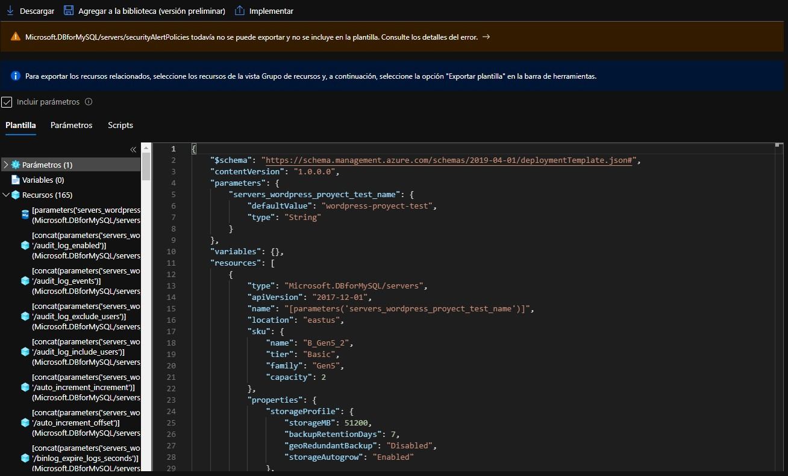

# ¿Cómo hacer una plantilla de Azure Resouce Manager (ARM)

- [**Indice**](#)
  - [Crea tu plantilla](#crea-tu-plantilla)
  - [Obtener una plantilla de ARM ya hecha]()
    - [Opción 1: Descargarla de un recurso existente en Azure Portal](#opción-1-descargarla-de-un-recurso-existente-en-azure-portal)
    - [Opción 2: Descargar la plantilla de todo un grupo de recursos](#opción-2-descargar-la-plantilla-de-todo-un-grupo-de-recursos)
    - [Opción 3: Obtenerla de la comunidad](#opción-3-obtenerla-de-la-comunidad)
  - [Implementa tu plantilla](#implementa-tu-plantilla)

:book: **Plantilla de Azure Resource Manager (ARM)**:  es un archivo de notación de objetos JavaScript (JSON) que contiene la infraestructura y la configuración del proyecto. En la plantilla se especifican los recursos que se van a implementar y las propiedades de esos recursos.

## Crea tu plantilla

## Obtener una plantilla de ARM ya hecha

### Opción 1: Descargarla de un recurso existente en Azure Portal

1. Dirigete a portal.azure.com
2. Una vez dentro, explora el detalle de un recurso haciendo clic desde la página principal o desde la sección **Todos los recursos**
3. Una vez dentro del recurso, desliza el menu lateral izquierdo hasta el fondo y encontrarás la opción **Exportar plantilla**

4. Encontrarás una interfaz similar a esta:

Dentro de esta interfaz podrás:

- **Descargar** la plantilla que resultará en dos archivos JSON editablesque contienen:
  - La o las plantillas
  - Los parametros usados en todas las plantillas. Por ejemplo, una dirección de serivdor, una dirección IP o un grupo de recursos único
- **Implementar** la plantilla para hacer una replica del recurso en el que te encuentras
- **Guardar en la biblioteca**. Donde podrás encontrar las plantillas que más uses o que necesites para después.

**Nota**: No puedes editar una plantilla desde el Azure Portal, para ello tendrías que descargarlas. Además, puedes bajarla o implementarla con o sin los parametros.

### Opción 2: Descargar la plantilla de todo un grupo de recursos

1. Dirigete a portal.azure.com
2. Una vez dentro, explora el detalle de un recurso haciendo clic desde la página principal o desde la sección **Todos los recursos**. Si no te aparece este botón, puedes buscarlo utilizando la barra de busqueda superior.
3. Selecciona un grupo de recursos
4. Una vez dentro del grupo de recursos, desliza el menu lateral izquierdo hasta el fondo y encontrarás la opción **Exportar plantilla**
5. Las opciones son las mismas que al descargar la plantilla de un solo recurso solo con la diferencia que aquí exportas la implementación de todos los recursos dentro del grupo.

### Opción 3: Obtenerla de la comunidad

Estas plantillas son creadas por personas de la comunidad de Azure de todo el mundo y todas están validadas para su uso.

1. Ve al repositorio de [Quickstart Templates](https://github.com/Azure/azure-quickstart-templates)
2. Escoge una plantilla y al hacer clic en ella te aparecerá la siguiente interfaz:

Donde puedes:

- Ver el código JSON de la plantilla en el archivo `azuredeploy.json`
- Implementarla en tu cuenta de Azure con un solo clic desde el botón Deploy to Azure. Esto te abrirá una ventana de portal.azure.com con todas las configuraciones de la plantilla donde tu puedes modificar los parametros y ordenar la ejecución manualmente
- Implementarla en un ambiente de Azure Gov si esta se encuentra validada para ello
- Ver las pruebas que ha pasado por medio de *badges*
- Verla en un diagrama similar a este:

## Implementa tu plantilla

